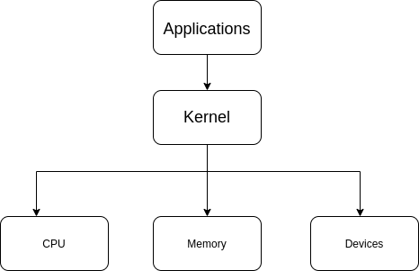

# Shell Scripting

## What is Kernel?
> The computer programs that allocates the system resources and coordinates all the details of the computer's internals is called the operating system or the Kernel. Users communicate with the OS through a program called the Shell.  

## What is a Shell?
- The Shell is a Command Line Interpreter. It transpiles commands entered by the user and coverts them into a language tha tis understood by the kernel.

## What is a Shell Script?
- The basic concept of a shell script is a list of commands which are listed in the order of execution. A good shell script will have comments, preceded by # sign, describing the steps.

## What is a Variable ?
- A variable is a character string to whihc we assign a value. The value assigned could be a number, text, filename, device or any other type of data.

## Variable Types:
- Local Variable
  - A local variable is a variable that is present within the current instance of the shell. It is not available to programs that are started by the shell. They are set at the command prompt.

- Environment Variable
  - An environment variable is available to any child process of the shell. Some programs need environment variables in order to function correctly.

- Shell Variable
  - A shell variable is a special variable that is set by the shell and is required by the shell in order to function correctly. Some of these are environment variables whereas others are local variables.

## Basic Operators
- Arithmetic Operators
- Relational Operators
- Boolean Operators
- String Operators
- File Test Operators

### Arithmetic Operators
- All Arithmetic operations are done using long integers
- All conditional expressions should be inside of square braces

| Operator           | Purpose                                                               | Example           |
| ------------------ | --------------------------------------------------------------------- | ----------------- |
| + (Addition)       | Adds values on either side of the operator                            | `$a + $b`         |
| - (Subtraction)    | Subtracts right hand operator from left operand                       | `$a - $b`         |
| * (Multiplication) | Multiplies values on either side of the operator                      | $a \* b           |
| / (Division)       | Divides left hand operand by the right hand operand                   | $a / $b           |
| % (Modulus)        | Divides left hand operand by right hand operand and returns remainder | $b % $a           |
| = (Assignment)     | Assigns right operand in left operand                                 | $a = $b or $a = 5 |
| == (Equality)      | Compares two numbers, if both are same then returns true              | [$a==$b]          |
| != (Not Equality)  | Compares two number, if bota are different then returns true          | [$a!=b]           |

### Relational Operators
- Relational operators do not work for string values unless string values are numeric.

| Operator | Purpose                                                                                      | Example     |
| -------- | -------------------------------------------------------------------------------------------- | ----------- |
| -eq      | Checks if the value of two operands are equal or not; if yes  true.                          | [$a -eq $b] |
| -ne      | Checks if the value of two operands are equal or not;  if no  true.                          | [$a -ne $b] |
| -gt      | Checks if the value of left operand is greater then right operand. if yes  true.             | [$a -gt $b] |
| -lt      | Checks if the value of left operand is less then right operand. if yes  true.                | [$a -lt $b] |
| -ge      | Checks if the value of left operand is greater then or equal to right operand. if yes  true. | [$a -ge $b] |
| -le      | Checks if the value of left operand is less then or equal right operand. if yes  true.       | [$a -le $b] |

### Boolean Operators

| Operator | Purpose                                                                              | Example                   |
| -------- | ------------------------------------------------------------------------------------ | ------------------------- |
| !        | This is a logical negation. This inverts a true condition into false and vice-versa. | [!false] is true          |
| -o       | This is logical OR. If one of the operands is true, then  true.                      | [$a -lt $b -o $b -gt 100] |
| -a       | This is logical AND. If both the operands are true, then  true otherwise false.      | [$a -lt 20 -a $b -gt 100] |

### String Operators

| Operator | Purpose                                                                                       | Example    |
| -------- | --------------------------------------------------------------------------------------------- | ---------- |
| =        | Checks if the value of two operands are equal or not. If yes, then  true                      | [$a = $b]  |
| !=       | Checks if the value of two operands are equal or not. If no, then  true.                      | [$a != $b] |
| -z       | Checks if the given string operand size is zero. If it is zero length, then it returns true.  | [-z $a]    |
| -n       | Checks if the given string operand size is non-zero. If it is non-zero, then it returns true. | [-n $a]    |
| str      | Checks if str is not the empty string. If it is empty, then it returns false.                 | [ $a ]     |

### File Test Operators

| Operator | Purpose                                                                                              | Example    |
| -------- | ---------------------------------------------------------------------------------------------------- | ---------- |
| -b file  | Checks if the file is a block special file. If yes, then true.                                       | [-b $file] |
| -c file  | Checks if the file is a character special file. If yes, then true.                                   | [-c $file] |
| -d file  | Checks if the file is a directory. If yes, then  true.                                               | [-d $file] |
| -f file  | Checks if the file is an ordinary file as opposed to a directory or special file. If yes, then true. | [-f $file] |
| -g file  | Checks if file has its set group ID (SGID) bit set. If yes, then true.                               | [-g $file] |
| -k file  | Checks if file has ites sticky bit set if yes, then  true.                                           | [-k $file] |
| -p file  | Checks if file is a named pipe. If yes, then true.                                                   | [-p $file] |
| -t file  | Checks if the descriptor is open and associated with a terminal. If yes, then true.                  | [-t $file] |
| -u file  | Checks if file has its Set User ID (SUID) bit set. If yes, then true.                                | [-u $file] |
| -r file  | Checks if file is readable. If yes, then true.                                                       | [-r $file] |
| -w file  | Checks if file is writable. If yes, then true.                                                       | [-w $file] |
| -x file  | Checks if file is executable. If yes, then true.                                                     | [-x $file] |
| -s file  | Checks if file size is greater than 0. If yes, then true.                                            | [-s $file] |
| -e file  | Checks if file exists. If yes, then true.                                                            | [-e $file] |